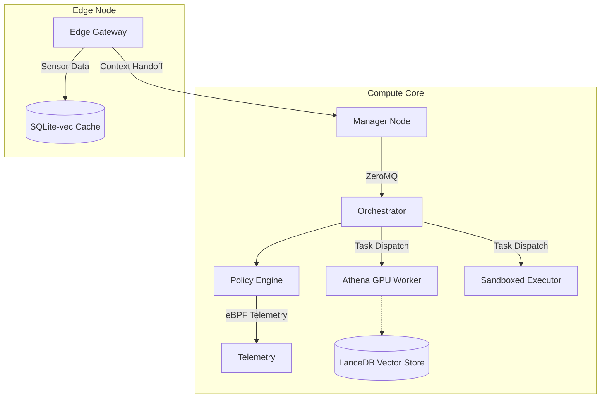
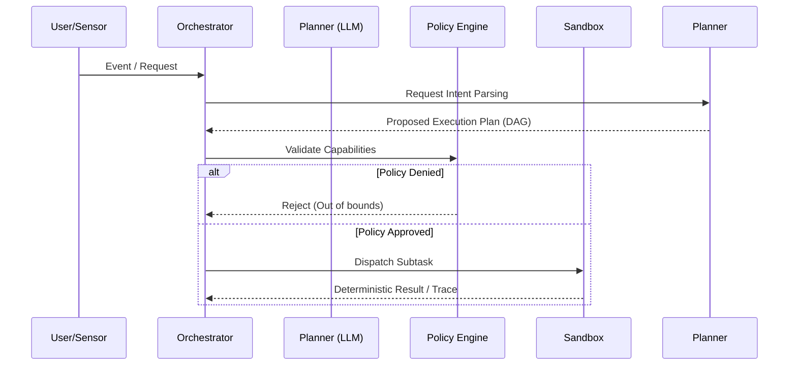

# OmniClaw

**A secure distributed orchestration runtime for autonomous and edge-native AI systems.**

OmniClaw is an event-driven execution platform designed to safely orchestrate local and distributed AI workflows. It provides the necessary infrastructure—deterministic routing, policy-constrained sandboxing, and unified telemetry—to bridge the gap between probabilistic LLM planners and secure, resilient host execution.

Built on ZeroMQ and engineered for heterogeneous topologies, OmniClaw allows workloads to scale from constrained edge nodes (Android/ARM) to GPU-accelerated Compute Cores, all governed by strict capability-based access controls.

---

## Core Philosophy

Probabilistic intelligence requires deterministic infrastructure.

LLMs are planners, not trusted operating systems. OmniClaw operates on the principle that autonomous systems must be strictly supervised, their execution boundaries explicitly defined, and their state heavily observable. We do not build "unconstrained AI swarms"; we build the high-assurance execution pipelines required to make autonomous workflows reliable in production.

- **Deterministic Execution:** Workflows are structured as predictable, replayable DAGs.
- **Policy-Constrained Autonomy:** Every action is intercepted and evaluated against predefined execution policies.
- **Edge-Native Architecture:** Resource scheduling adapts dynamically to thermal and memory constraints.
- **Unified Observability:** Every sub-task, routing decision, and security intervention is traced.

---

## Architecture Overview

OmniClaw uses a decentralized `ROUTER-DEALER` topology to manage execution across varying hardware footprints.



The system is split across two primary trust domains:

1. **Compute Core:** The sovereign backend handling heavy orchestration, eBPF-enforced sandboxing, vector search (LanceDB), and large model inference.
2. **Edge Node:** An unprivileged, highly constrained sensor hub (e.g., an ARM-based phone running Termux) that handles lightweight inference, localized vector caching (SQLite-vec), and context handoff to the core.

---

## Execution Pipeline

OmniClaw strictly separates intent parsing from execution.



---

## Security Model

OmniClaw assumes the planner is compromised or hallucinating.

- **eBPF Shield (Compute Core):** Deep kernel-level introspection monitors execution anomalies, preventing out-of-bounds syscalls or unauthorized network connections.
- **Process Sandboxing:** Code executed by the system (e.g., SymPy scripts, Python patches) runs in an `unshare` chroot environment with isolated cgroups.
- **Capability-Based Execution:** Workers define explicit capabilities during the `REGISTER` phase. The manager routes tasks only to authorized, sandboxed workers.
- **Edge Isolation:** The Edge Node operates strictly in userspace (`proot`/`strace`) without root privileges, treating the Compute Core as the ultimate source of truth and security.

---

## Orchestration Engine

The orchestration layer is built entirely on asynchronous ZeroMQ messaging, replacing brittle synchronous HTTP calls with resilient, multiplexed sockets.

- **Event-Driven Routing:** MessagePack payloads stream over a central `ROUTER` socket, ensuring low latency.
- **Deadlock Resolution:** The Manager implements timeout handling and worker reassignment for stalled tasks.
- **Context Handoffs:** If an Edge Node lacks the context to fulfill a query locally, it issues a `CONTEXT_HANDOFF_REQUEST` to the Compute Core's LanceDB.

---

## Observability Stack

You cannot secure what you cannot see. OmniClaw instruments every layer of the execution pipeline.

- **Distributed Tracing:** Spans are created for intention parsing, policy checks, queue residency, and actual execution.
- **Telemetry Daemons:** Ring buffers expose underlying system health, allowing the orchestrator to dynamically shed load during Out-of-Memory (OOM) predictions or GPU thermal throttling events.

---

## Deployment Topology

Deploying OmniClaw requires mapping its components to your hardware topology.

```yaml
# policy.yaml (Abridged)
ebpf_heuristics:
  oom_prediction_lead_seconds: 30
athena:
  max_gpu_temp_c: 82
network_qos:
  orchestration_dscp: 46   # Expedited Forwarding
```

- **Primary Node:** Requires Linux (Ubuntu/Debian recommended), `bpf` capabilities, and Docker.
- **Edge Node:** Runs entirely within Termux (Android) utilizing Python and lightweight C++ bindings.

---

## Quick Start

### 1. Compute Core Installation

```bash
git clone https://github.com/webspoilt/omniclaw.git
cd omniclaw

# Install core dependencies (requires Python 3.10+)
pip install -r requirements.txt

# Start the ZeroMQ Orchestrator
python3 -m core.zmq_orchestrator
```

### 2. Edge Node Attachment (Termux)

```bash
# On your Android device
pkg install python zmq sqlite
pip install -r requirements-edge.txt

# Attach to the Compute Core
OMNICLAW_MANAGER_IP=192.168.1.50 python3 -m edge.gateway
```

---

## Contribution Guide

OmniClaw is an open-source infrastructure project. We welcome contributions focused on:

- eBPF probe enhancements
- ZeroMQ queue optimization
- Deterministic mathematical solvers for the Athena engine
- Cross-platform vector sync optimizations

Please review `CONTRIBUTING.md` for our strict PR guidelines and testing requirements.
