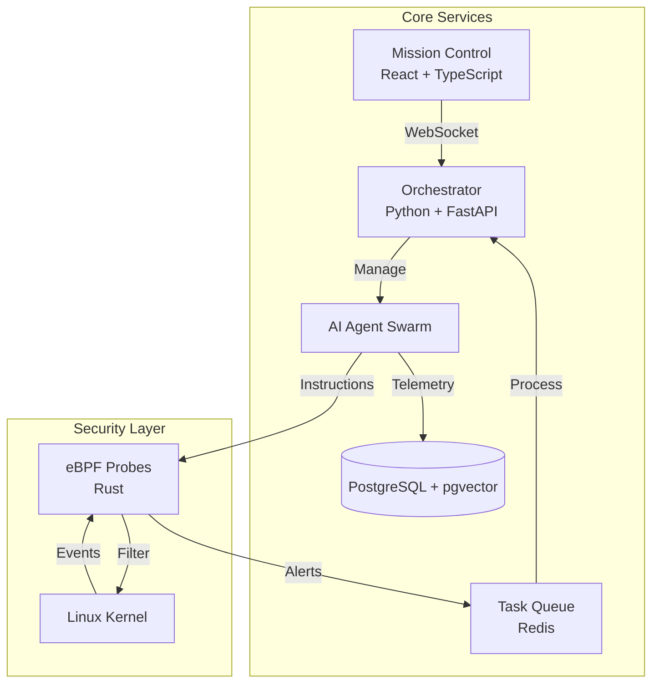

<p align="center">
  
</p>

# Omniclaw: Sovereign Sentinel v4.5.0

<div align="center" style="font-size: 1.5em; margin: 20px 0;">
    <strong>O</strong>rchestrated <strong>M</strong>odular <strong>N</strong>etwork <strong>I</strong>ntelligence for <strong>C</strong>yber <strong>L</strong>atent <strong>A</strong>gent <strong>W</strong>arfare
</div>
<br>
<div align="center">

> **Join the Sovereignty!** Connect with security researchers, AI engineers, and fellow hive-defenders. Get support, share insights, and stay updated with the latest Omniclaw developments.

[](https://discord.gg/omniclaw)⠀[](https://t.me/omniclaw)⠀[](https://www.buymeacoffee.com/webspoilt)

<a href="https://github.com/webspoilt/omniclaw" target="_blank"></a>

</div>

## Table of Contents

- [Overview](#overview)
- [Features](#features)
- [Architecture](#architecture)
- [Quick Start](#quick-start)
- [Documentation](#documentation)
- [AI Agent Supervision](#ai-agent-supervision)
- [Kernel Bridge (eBPF)](#kernel-bridge-ebpf)
- [Security](#security)
- [Credits](#credits)
- [License](#license)

## Overview

Omniclaw is an innovative autonomous cybersecurity platform that leverages a "Hybrid Hive" of AI agents to perform real-time threat detection, automated forensics, and kernel-level neutralization. Unlike traditional IPS/IDS, Omniclaw doesn't just watch—it acts.

## Documentation 📚

Comprehensive documentation is available to help you deploy and master the Sovereign Sentinel platform:

- 🍼 **[Deployment Guide](docs/setup.md)**: Step-by-step instructions for Linux, macOS, and Android (Termux).
- 🚀 **[Use Cases](docs/use_cases.md)**: Real-world scenarios for security, sysadmin, and research.
- 📖 **[GitHub Wiki](https://github.com/webspoilt/omniclaw/wiki)**: Deep-dives into Architecture, Security Layers, and P2P Networking.
- 🛡️ **[Security Policy](SECURITY.md)**: Guidelines for reporting vulnerabilities.
- 🤝 **[Contributing Guide](CONTRIBUTING.md)**: How to join the ZeroDay development team.

## Features

- 🛡️ **Kernel-Level Defense.** Rust-based eBPF probes provide deep, zero-overhead visibility into system calls and network traffic.
- 🤖 **Autonomous Swarm.** A decentralized team of AI agents that automatically determine and execute defensive steps without human intervention.
- ⚡ **Zero-Trust Orchestration.** Secure communication between agents using P2P encryption and hardware-backed identity.
- 🧩 **Modular Plugin System.** Hot-swap detection engines, notification connectors, and response playbooks without restarting.
- 📊 **Mission Control.** A sleek, real-time dashboard for system monitoring, telemetry visualization, and manual override.
- 🔗 **External SIEM Integration.** Out-of-the-box support for Splunk, Elastic, and custom webhooks.

## Architecture

Omniclaw is built on a distributed micro-agent architecture designed for resilience and speed.



## Quick Start

### Installation

The fastest way to deploy the Sovereign Sentinel node is via the official setup script:

```bash
curl -fsSL https://omniclaw.vercel.app/setup.sh | bash
```

### Manual Setup

1. **Clone and Install Dependencies**
```bash
git clone https://github.com/webspoilt/omniclaw.git
cd omniclaw
pip install -r requirements.txt
```

2. **Configure Environment**
```bash
cp .env.example .env
# Add your LLM API keys and configuration
```

3. **Launch the Orchestrator**
```bash
python orchestrator.py
```

## AI Agent Supervision

Omniclaw includes sophisticated multi-layered agent supervision to ensure efficient task execution and prevent hallucination loops:

- **Mentor Agent**: Automatically monitors agent behavior and recommends alternative attack/defense vectors.
- **Pattern Detection**: Detects redundant tool calls and redirects agents to search for established solutions.
- **Self-Healing**: If an agent fails to reach a target, the Reflector agent analyzes the failure and updates the Hive context.

## Kernel Bridge (eBPF)

The heart of Omniclaw's visibility is the Rust-based kernel bridge.
- **Direct Link**: Connects the AI Hive directly to the Linux kernel.
- **Zero Overhead**: eBPF bytecode executes in the kernel context for maximum performance.
- **Packet-Level Inspection**: Inspects every packet before it reaches the network stack.

## Security

Please report security vulnerabilities to **heyzerodayhere@gmail.com**. See [SECURITY.md](SECURITY.md) for more details.

---

Built with ❤️ by  **zeroday**
⭐ Star  on [GitHub](https://github.com/webspoilt/omniclaw) if you believe in the future of autonomous defense!
