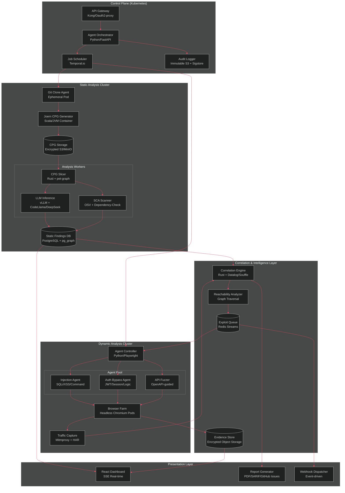
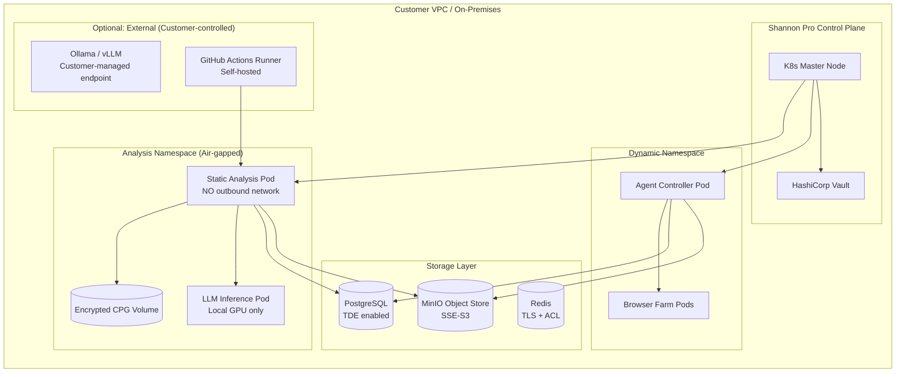
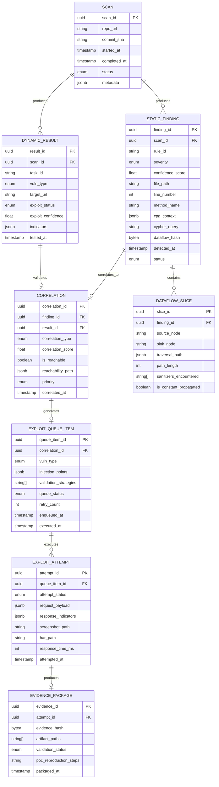

# Shannon Pro — System Architecture Blueprint
## A Zero-Trust, Self-Hosted Application Security Platform

**Classification:** Internal Architecture Document  
**Version:** 1.0.0  
**Date:** 2026-04-23  
**Architect:** Lead Security Architect / Principal Engineer

---

## 1. Executive Summary

Shannon Pro is a dual-stage, agentic application security platform that bridges the gap between static code analysis and dynamic vulnerability validation. The platform operates on a **"zero-trust, never-leave"** principle — source code, code property graphs, and LLM interactions remain entirely within the customer's infrastructure. Static findings are correlated with dynamic exploitation evidence via a deterministic correlation engine, producing only validated, actionable security intelligence.

---

## 2. High-Level System Architecture

### 2.1 Core Philosophy

| Principle | Implementation |
|-----------|---------------|
| **Zero-Trust Isolation** | Every analysis runs in ephemeral, sandboxed containers |
| **Never-Leave Guarantee** | LLM inference via local Ollama/vLLM; no external API calls for code analysis |
| **POC-or-It-Didn't-Happen** | No finding is reported without dynamic validation evidence |
| **Deterministic Correlation** | Static findings map to dynamic exploit queues via graph-backed reachability analysis |
| **Immutable Audit Trail** | All decisions, LLM prompts, and evidence are tamper-evident logged |

### 2.2 Architecture Diagram (Mermaid)



---

## 3. Module Breakdown

### 3.1 Control Plane Modules

| Module | Technology | Responsibility |
|--------|-----------|----------------|
| **API Gateway** | Kong + oauth2-proxy | AuthN/AuthZ, rate limiting, request routing |
| **Agent Orchestrator** | Python 3.12 + FastAPI | Workflow coordination, state machine management |
| **Job Scheduler** | Temporal.io | Durable execution, retries, timeouts, saga pattern |
| **Audit Logger** | Sigstore + S3/MinIO | Tamper-evident logging of all security decisions |

### 3.2 Static Analysis Engine Modules

| Module | Technology | Responsibility |
|--------|-----------|----------------|
| **Git Clone Agent** | Go + libgit2 | Ephemeral repo cloning with secret scanning (gitleaks) |
| **CPG Generator** | Joern (Scala) | Multi-language CPG generation (C/C++, Java, JS, Python, Go) |
| **CPG Slicer** | Rust + petgraph | Program slicing, dataflow extraction, taint analysis |
| **LLM Inference** | vLLM + DeepSeek-Coder/StarCoder2 | Local inference for vulnerability reasoning |
| **SCA Engine** | OSV + OWASP DC | Dependency vulnerability scanning, SBOM generation |
| **Static Findings DB** | PostgreSQL + pg_graph | Structured storage with graph relationship indexing |

### 3.3 Dynamic Analysis Engine Modules

| Module | Technology | Responsibility |
|--------|-----------|----------------|
| **Agent Controller** | Python 3.12 + Playwright | Dynamic agent lifecycle, browser farm management |
| **Injection Agent** | Python + Playwright | SQLi, XSS, command injection, path traversal testing |
| **Auth Bypass Agent** | Python + Playwright | Session manipulation, JWT attacks, logic flaw testing |
| **API Fuzzer** | Python + Schemathesis | OpenAPI-guided stateful API fuzzing |
| **Browser Farm** | Headless Chromium (Deno) | Ephemeral browser instances per test session |
| **Traffic Capture** | mitmproxy | HAR generation, request/response evidence collection |

### 3.4 Correlation & Intelligence Modules

| Module | Technology | Responsibility |
|--------|-----------|----------------|
| **Correlation Engine** | Rust + Souffle Datalog | Static-to-dynamic finding correlation, deduplication |
| **Reachability Analyzer** | Rust + CPG traversal | Deterministic path validation from source to sink |
| **Exploit Queue** | Redis Streams | Priority-ordered dynamic testing queue |
| **Evidence Store** | Encrypted MinIO/S3 | Immutable POC evidence, screenshots, HAR files |

---

## 4. API / Inter-Process Communication Flow

### 4.1 Communication Patterns

```
┌─────────────────────────────────────────────────────────────────────────┐
│                    COMMUNICATION MATRIX                                   │
├──────────────────────────┬──────────────┬──────────────┬────────────────┤
│ Channel                  │ Protocol     │ Serialization│ Security       │
├──────────────────────────┼──────────────┼──────────────┼────────────────┤
│ Orchestrator → Workers   │ gRPC         │ Protobuf     │ mTLS + SPIFFE  │
│ Workers → PostgreSQL     │ TCP          │ SQL/binary   │ TLS 1.3        │
│ Workers → Redis          │ TCP          │ RESP3        │ TLS + ACL      │
│ Workers → S3/MinIO       │ HTTP/2       │ Binary       │ IAM + SSE-KMS  │
│ Browser Farm → Controller│ WebSocket    │ JSON+msgpack │ mTLS           │
│ LLM Inference            │ HTTP/1.1     │ JSON         │ Unix socket    │
│ Event Bus                │ NATS         │ Protobuf     │ mTLS + JWT     │
└──────────────────────────┴──────────────┴──────────────┴────────────────┘
```

### 4.2 gRPC Service Definitions

```protobuf
// static_analysis.proto
syntax = "proto3";
package shannon.static.v1;

service StaticAnalysisService {
  rpc AnalyzeRepository(RepositoryRequest) returns (stream Finding);
  rpc GetSliceContext(SliceRequest) returns (SliceContext);
  rpc SubmitSCAResults(ScanResults) returns (Ack);
}

message RepositoryRequest {
  string repo_url = 1;
  string commit_sha = 2;
  bytes access_token_encrypted = 3;  // AES-256-GCM encrypted
  map<string, string> analysis_config = 4;
}

message Finding {
  string finding_id = 1;           // ULID
  string rule_id = 2;              // e.g., "sqli-taint-missing-sanitizer"
  Severity severity = 3;
  Location location = 4;
  CPGContext cpg_context = 5;
  float confidence_score = 6;      // 0.0 - 1.0
  repeated string tags = 7;
  bytes evidence_hash = 8;         // SHA-256 of evidence blob
}

message CPGContext {
  string method_name = 1;
  string file_path = 2;
  int32 line_start = 3;
  int32 line_end = 4;
  string dataflow_path = 5;        // Serialized subgraph
  string slice_cypher = 6;         // Cypher query to reproduce
}
```

```protobuf
// dynamic_agent.proto
syntax = "proto3";
package shannon.dynamic.v1;

service DynamicAgentService {
  rpc RegisterAgent(AgentRegistration) returns (AgentConfig);
  rpc ExecuteExploit(ExploitTask) returns (stream ExploitResult);
  rpc SubmitEvidence(Evidence) returns (Ack);
  rpc Heartbeat(stream AgentStatus) returns (stream ControllerCommand);
}

message ExploitTask {
  string task_id = 1;
  string finding_id = 2;           // Links to static finding
  string target_url = 3;
  VulnerabilityType vuln_type = 4;
  map<string, string> injection_points = 5;
  repeated string validation_strategies = 6;
  int32 max_attempts = 7;
  int32 timeout_seconds = 8;
}

message ExploitResult {
  string task_id = 1;
  ExploitStatus status = 2;        // PENDING / RUNNING / VALIDATED / FAILED / ERROR
  string validation_proof = 3;     // Serialized POC evidence
  bytes screenshot_hash = 4;
  bytes har_hash = 5;
  float exploit_confidence = 6;
  repeated string indicators = 7;  // Observed behavior indicators
}
```

```protobuf
// correlation.proto
syntax = "proto3";
package shannon.correlation.v1;

service CorrelationService {
  rpc CorrelateFindings(CorrelationRequest) returns (CorrelationReport);
  rpc ComputeReachability(ReachabilityRequest) returns (ReachabilityResult);
  rpc GenerateExploitQueue(QueueRequest) returns (ExploitQueue);
}

message CorrelationRequest {
  string scan_id = 1;
  repeated string static_finding_ids = 2;
  repeated string dynamic_results = 3;
}

message ReachabilityRequest {
  string finding_id = 1;
  string entrypoint_method = 2;
  string sink_method = 3;
}

message ExploitQueue {
  string queue_id = 1;
  repeated QueuedExploit items = 2;
  Priority priority = 3;
}
```

### 4.3 Event Bus (NATS) Subjects

```
shannon.scan.started
shannon.scan.completed
shannon.cpg.generated
shannon.finding.static.created
shannon.finding.static.correlated
shannon.exploit.queued
shannon.exploit.started
shannon.exploit.validated
shannon.exploit.failed
shannon.report.generated
shannon.alert.critical
```

---

## 5. Data Privacy and Security Model

### 5.1 Threat Model

| Threat | Mitigation |
|--------|-----------|
| Source code exfiltration | Air-gapped execution; no outbound network from analysis pods |
| LLM prompt leakage | Local inference only (vLLM/ollama); no cloud LLM APIs |
| Credential exposure | SOPS + HashiCorp Vault; runtime injection only |
| Privilege escalation | gVisor/Kata Containers; seccomp-bpf; no root |
| Evidence tampering | Sigstore cosign; Merkle tree audit log; WORM storage |
| Side-channel attacks | Constant-time crypto; dedicated CPU/memory isolation |

### 5.2 Deployment Architecture: Self-Hosted Runner



### 5.3 Encryption Strategy

```
┌────────────────────────────────────────────────────────────────┐
│ ENCRYPTION IN TRANSIT & AT REST                                 │
├────────────────────────────────────────────────────────────────┤
│ Layer          │ Method                                        │
├────────────────────────────────────────────────────────────────┤
│ Pod-to-Pod     │ mTLS via Istio/Linkerd + SPIFFE identities    │
│ DB Connection  │ TLS 1.3 with certificate pinning              │
│ S3/MinIO       │ SSE-KMS (customer-managed keys)               │
│ CPG at Rest    │ AES-256-GCM with per-scan key derivation      │
│ LLM Prompts    │ Never persisted; processed in-memory only     │
│ Audit Logs     │ Sigstore signed; append-only WORM bucket      │
│ Git Tokens     │ SOPS-encrypted in Vault; runtime injection    │
└────────────────────────────────────────────────────────────────┘
```

### 5.4 Network Policies (Kubernetes)

```yaml
# Air-gapped static analysis namespace
apiVersion: networking.k8s.io/v1
kind: NetworkPolicy
metadata:
  name: static-analysis-airgap
  namespace: shannon-static
spec:
  podSelector:
    matchLabels:
      app: static-analysis
  policyTypes:
    - Ingress
    - Egress
  ingress:
    - from:
        - namespaceSelector:
            matchLabels:
              name: shannon-control
  egress:
    - to: []  # NO external egress
    - to:
        - namespaceSelector:
            matchLabels:
              name: shannon-storage
      ports:
        - protocol: TCP
          port: 5432   # PostgreSQL only
        - protocol: TCP
          port: 9000   # MinIO only
```

---

## 6. Production Tech Stack

### 6.1 Language & Runtime Selection

| Component | Language | Justification |
|-----------|----------|---------------|
| CPG Slicer | Rust | Zero-cost abstractions, memory safety, parallel graph traversal |
| Correlation Engine | Rust | Datalog evaluation, deterministic performance |
| Agent Orchestrator | Python 3.12 | Rich async ecosystem, Playwright integration |
| Dynamic Agents | Python 3.12 | Rapid exploit script development, readability |
| API Gateway | Go | High-concurrency, low-latency proxy |
| CPG Generator | Scala (Joern) | Native Joern integration, JVM ecosystem |
| Dashboard | TypeScript/React | Component-rich UI, real-time SSE |

### 6.2 Infrastructure Stack

| Layer | Technology |
|-------|-----------|
| Container Orchestration | Kubernetes 1.29+ + gVisor runtime |
| Service Mesh | Istio (mTLS, authz) |
| Secret Management | HashiCorp Vault + External Secrets Operator |
| GitOps | ArgoCD |
| Observability | Grafana + Tempo + Loki + Prometheus |
| Event Bus | NATS JetStream |
| Object Storage | MinIO (self-hosted) |
| Database | PostgreSQL 16 + pg_graph |
| Cache/Queue | Redis 7 Cluster |

### 6.3 Security Tooling

| Category | Tool |
|----------|------|
| SAST Engine | Joern (CPG) + Semgrep (rules) |
| SCA Engine | OSV Scanner + Syft (SBOM) |
| Secret Scanning | Gitleaks + TruffleHog |
| Container Scanning | Trivy |
| Policy Enforcement | OPA/Gatekeeper |
| Supply Chain | Sigstore cosign + SLSA provenance |

---

## 7. Data Schema: Static-to-Dynamic Correlation

### 7.1 Core Entity Relationship Diagram



### 7.2 PostgreSQL DDL

```sql
-- Core scan tracking
CREATE TABLE scans (
    scan_id UUID PRIMARY KEY DEFAULT gen_random_uuid(),
    repo_url TEXT NOT NULL,
    commit_sha VARCHAR(40) NOT NULL,
    started_at TIMESTAMPTZ DEFAULT NOW(),
    completed_at TIMESTAMPTZ,
    status VARCHAR(20) DEFAULT 'pending' CHECK (status IN ('pending', 'cloning', 'cpg_generating', 'analyzing', 'correlating', 'pentesting', 'completed', 'failed')),
    metadata JSONB DEFAULT '{}',
    created_at TIMESTAMPTZ DEFAULT NOW()
);

-- Static findings with graph context
CREATE TABLE static_findings (
    finding_id UUID PRIMARY KEY DEFAULT gen_random_uuid(),
    scan_id UUID NOT NULL REFERENCES scans(scan_id) ON DELETE CASCADE,
    rule_id VARCHAR(100) NOT NULL,
    severity VARCHAR(20) CHECK (severity IN ('critical', 'high', 'medium', 'low', 'info')),
    confidence_score DECIMAL(4,3) CHECK (confidence_score >= 0 AND confidence_score <= 1),
    file_path TEXT NOT NULL,
    line_number INT NOT NULL,
    method_name VARCHAR(500),
    cpg_context JSONB NOT NULL DEFAULT '{}',
    cypher_query TEXT,                    -- Reproducible CPG traversal
    dataflow_hash BYTEA,                  -- SHA-256 of serialized dataflow
    source_node VARCHAR(500),             -- Taint source
    sink_node VARCHAR(500),               -- Taint sink
    has_sanitizer BOOLEAN DEFAULT FALSE,
    sanitizer_type VARCHAR(100),
    status VARCHAR(20) DEFAULT 'open' CHECK (status IN ('open', 'confirmed', 'false_positive', 'suppressed')),
    detected_at TIMESTAMPTZ DEFAULT NOW(),
    
    CONSTRAINT unique_finding_per_scan UNIQUE(scan_id, rule_id, file_path, line_number, method_name)
);

-- Program slices for LLM context
CREATE TABLE dataflow_slices (
    slice_id UUID PRIMARY KEY DEFAULT gen_random_uuid(),
    finding_id UUID NOT NULL REFERENCES static_findings(finding_id) ON DELETE CASCADE,
    source_node VARCHAR(500) NOT NULL,
    sink_node VARCHAR(500) NOT NULL,
    traversal_path JSONB NOT NULL,        -- Ordered list of AST nodes
    path_length INT NOT NULL DEFAULT 0,
    sanitizers_encountered TEXT[] DEFAULT '{}',
    is_constant_propagated BOOLEAN DEFAULT FALSE,
    slice_cypher TEXT,                    -- Cypher to regenerate this slice
    created_at TIMESTAMPTZ DEFAULT NOW()
);

-- Dynamic testing results
CREATE TABLE dynamic_results (
    result_id UUID PRIMARY KEY DEFAULT gen_random_uuid(),
    scan_id UUID NOT NULL REFERENCES scans(scan_id) ON DELETE CASCADE,
    task_id VARCHAR(100) NOT NULL UNIQUE,
    vuln_type VARCHAR(50) NOT NULL,
    target_url TEXT NOT NULL,
    exploit_status VARCHAR(20) DEFAULT 'pending' CHECK (exploit_status IN ('pending', 'running', 'validated', 'failed', 'error', 'timeout')),
    exploit_confidence DECIMAL(4,3) CHECK (exploit_confidence >= 0 AND exploit_confidence <= 1),
    indicators JSONB DEFAULT '{}',
    tested_at TIMESTAMPTZ DEFAULT NOW()
);

-- Correlation engine output
CREATE TABLE correlations (
    correlation_id UUID PRIMARY KEY DEFAULT gen_random_uuid(),
    finding_id UUID NOT NULL REFERENCES static_findings(finding_id),
    result_id UUID REFERENCES dynamic_results(result_id),
    correlation_type VARCHAR(30) CHECK (correlation_type IN ('static_only', 'dynamic_validated', 'unreachable', 'false_positive')),
    correlation_score DECIMAL(4,3) NOT NULL,
    is_reachable BOOLEAN DEFAULT FALSE,
    reachability_path JSONB,              -- Deterministic path from entrypoint to sink
    priority VARCHAR(20) DEFAULT 'medium' CHECK (priority IN ('critical', 'high', 'medium', 'low')),
    correlated_at TIMESTAMPTZ DEFAULT NOW(),
    
    CONSTRAINT unique_correlation UNIQUE(finding_id)
);

-- Exploit queue (Redis-backed, persisted to PostgreSQL)
CREATE TABLE exploit_queue (
    queue_item_id UUID PRIMARY KEY DEFAULT gen_random_uuid(),
    correlation_id UUID NOT NULL REFERENCES correlations(correlation_id),
    vuln_type VARCHAR(50) NOT NULL,
    injection_points JSONB NOT NULL,      -- Discovered injection points
    validation_strategies TEXT[] NOT NULL,-- Ordered list of validation techniques
    queue_status VARCHAR(20) DEFAULT 'queued' CHECK (queue_status IN ('queued', 'assigned', 'running', 'completed', 'failed', 'cancelled')),
    retry_count INT DEFAULT 0,
    max_retries INT DEFAULT 3,
    enqueued_at TIMESTAMPTZ DEFAULT NOW(),
    executed_at TIMESTAMPTZ,
    completed_at TIMESTAMPTZ
);

-- Exploit attempts with evidence
CREATE TABLE exploit_attempts (
    attempt_id UUID PRIMARY KEY DEFAULT gen_random_uuid(),
    queue_item_id UUID NOT NULL REFERENCES exploit_queue(queue_item_id),
    attempt_status VARCHAR(20) DEFAULT 'pending' CHECK (attempt_status IN ('pending', 'running', 'validated', 'failed', 'error')),
    request_payload JSONB,                -- Full request details
    response_indicators JSONB,            -- Observed response behavior
    screenshot_path TEXT,                 -- S3/MinIO path
    har_path TEXT,                        -- HTTP Archive path
    response_time_ms INT,
    attempted_at TIMESTAMPTZ DEFAULT NOW()
);

-- Evidence packages (immutable)
CREATE TABLE evidence_packages (
    evidence_id UUID PRIMARY KEY DEFAULT gen_random_uuid(),
    attempt_id UUID NOT NULL REFERENCES exploit_attempts(attempt_id),
    evidence_hash BYTEA NOT NULL,         -- SHA-256 of all artifacts
    artifact_paths TEXT[] NOT NULL,       -- List of S3/MinIO paths
    validation_status VARCHAR(20) CHECK (validation_status IN ('pending', 'confirmed', 'inconclusive', 'false_positive')),
    poc_reproduction_steps TEXT,          -- Human-readable steps
    cosign_signature BYTEA,               -- Sigstore signature
    packaged_at TIMESTAMPTZ DEFAULT NOW()
);

-- Indexes for performance
CREATE INDEX idx_findings_scan ON static_findings(scan_id);
CREATE INDEX idx_findings_severity ON static_findings(severity);
CREATE INDEX idx_findings_status ON static_findings(status);
CREATE INDEX idx_slices_finding ON dataflow_slices(finding_id);
CREATE INDEX idx_correlations_finding ON correlations(finding_id);
CREATE INDEX idx_correlations_reachable ON correlations(is_reachable) WHERE is_reachable = TRUE;
CREATE INDEX idx_queue_status ON exploit_queue(queue_status);
CREATE INDEX idx_attempts_queue ON exploit_attempts(queue_item_id);

-- Full-text search on code context
CREATE INDEX idx_findings_cpg_gin ON static_findings USING GIN(cpg_context);
CREATE INDEX idx_correlations_path_gin ON correlations USING GIN(reachability_path);
```

### 7.3 Correlation Logic (Pseudocode)

```rust
// correlation_engine/src/engine.rs
pub fn correlate_findings(
    static_findings: Vec<StaticFinding>,
    dynamic_results: Vec<DynamicResult>,
) -> Vec<Correlation> {
    let mut correlations = Vec::new();
    
    for finding in &static_findings {
        // Step 1: Compute reachability via CPG traversal
        let reachability = compute_reachability(&finding.cpg_context);
        
        // Step 2: Match with dynamic results on vulnerability type + location
        let matched_dynamic = dynamic_results.iter()
            .filter(|d| d.vuln_type == finding.vuln_type)
            .filter(|d| d.target_url.contains(&finding.file_path))
            .collect::<Vec<_>>();
        
        // Step 3: Calculate correlation score
        let correlation_score = calculate_score(&finding, &matched_dynamic, &reachability);
        
        // Step 4: Determine priority based on severity + reachability + confidence
        let priority = determine_priority(&finding, reachability.is_reachable, correlation_score);
        
        let correlation = Correlation {
            finding_id: finding.finding_id,
            result_id: matched_dynamic.first().map(|d| d.result_id),
            correlation_type: if matched_dynamic.is_empty() {
                if reachability.is_reachable {
                    CorrelationType::StaticOnly
                } else {
                    CorrelationType::Unreachable
                }
            } else {
                CorrelationType::DynamicValidated
            },
            correlation_score,
            is_reachable: reachability.is_reachable,
            reachability_path: Some(reachability.path),
            priority,
        };
        
        correlations.push(correlation);
    }
    
    // Step 5: Generate exploit queue for reachable, uncorrelated findings
    generate_exploit_queue(&correlations);
    
    correlations
}
```

---

## 8. Operational Excellence

### 8.1 SLAs & Resource Limits

| Metric | Target |
|--------|--------|
| CPG Generation | < 5 min per 100k LOC |
| Static Analysis | < 10 min per 100k LOC |
| Exploit Queue Processing | < 2 min per item |
| Dashboard Latency | < 200ms p99 |
| System Availability | 99.9% |
| False Positive Rate | < 15% (static), < 5% (correlated) |

### 8.2 Disaster Recovery

| Component | RPO | RTO |
|-----------|-----|-----|
| PostgreSQL | 5 min | 15 min (streaming replica) |
| Evidence Store | 0 (WORM) | 5 min (multi-site replication) |
| CPG Cache | 0 (recomputable) | 30 min |
| Configuration | 0 (GitOps) | 10 min |

---

## 9. Appendix

### A. Glossary
- **CPG**: Code Property Graph — unified AST + CFG + PDG representation
- **Slice**: A subgraph of the CPG representing a specific computation
- **POC**: Proof of Concept — demonstrated exploit evidence
- **SOP**: Standard Operating Procedure
- **SARIF**: Static Analysis Results Interchange Format

### B. Document History

| Version | Date | Author | Changes |
|---------|------|--------|---------|
| 1.0.0 | 2026-04-23 | Lead Architect | Initial architecture blueprint |

---

**END OF DOCUMENT**
